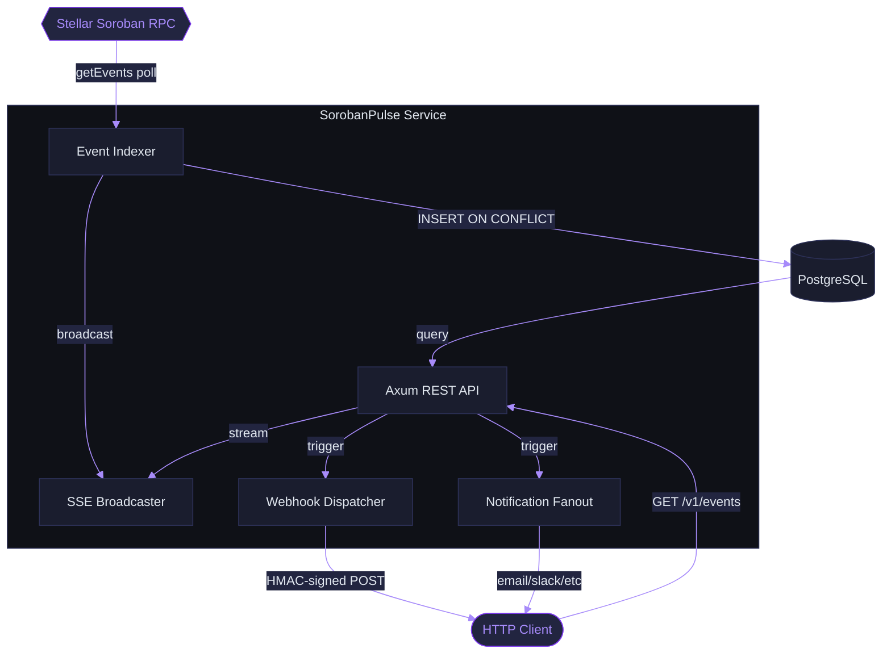
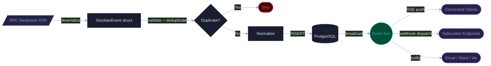
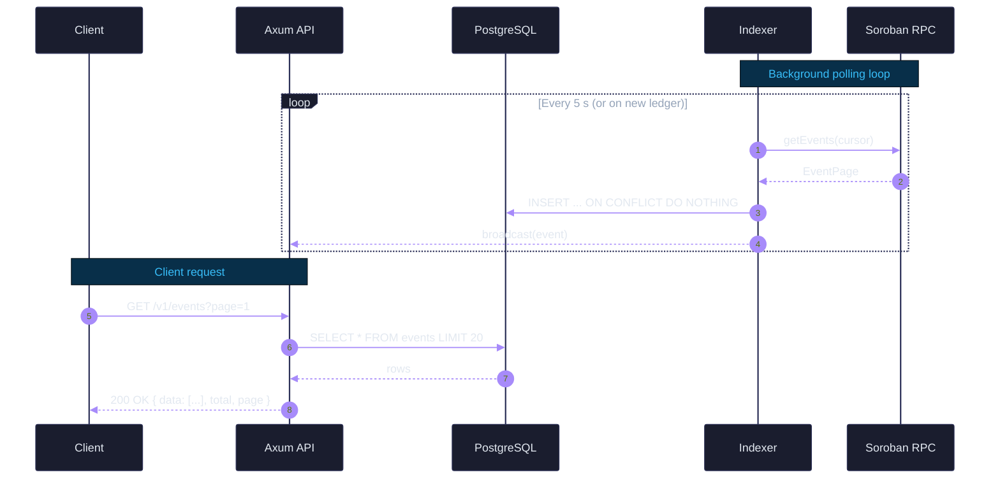
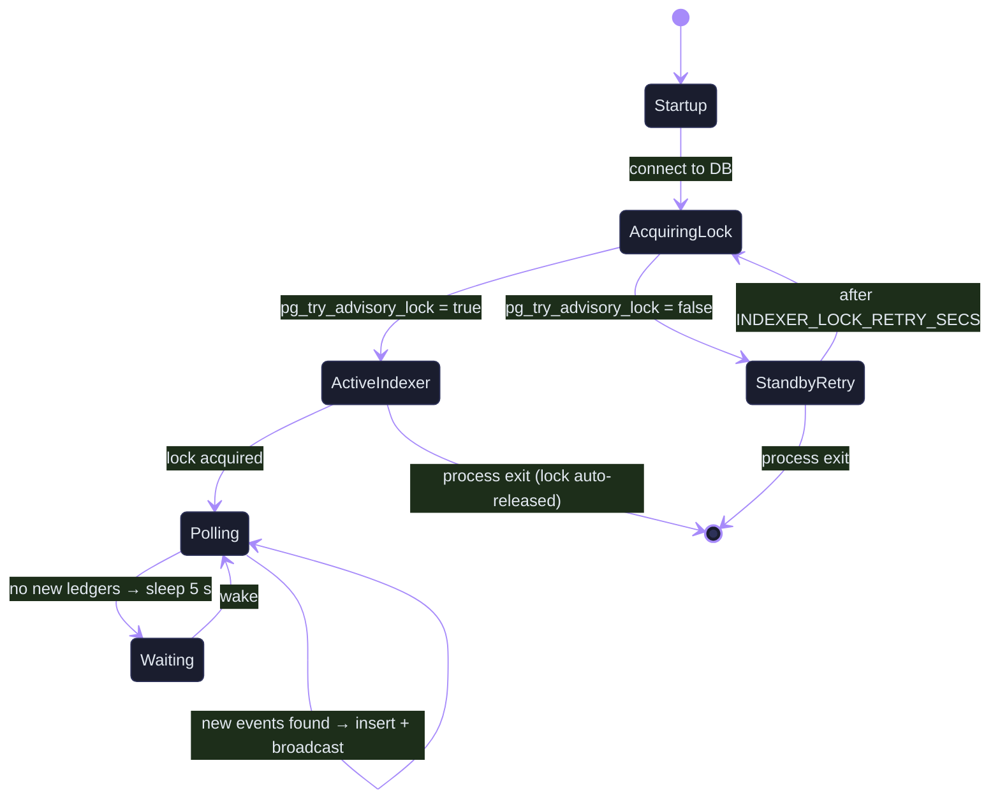
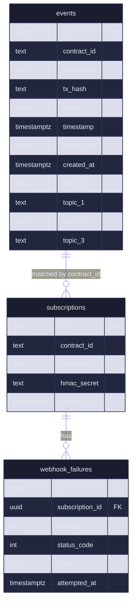

# SorobanPulse Diagram Style Guide

Every architecture, data-flow, and sequence diagram in the SorobanPulse docs follows the conventions in this file. Consistent diagrams reduce cognitive load and make the docs feel like a single, coherent product.

> **Tooling:** All diagrams are written in [Mermaid](https://mermaid.js.org/). Docusaurus renders them natively via `@docusaurus/theme-mermaid`. Local preview: `npx @mermaid-js/mermaid-cli -i diagram.mmd -o diagram.svg`.

---

## Colour Palette

Use the SorobanPulse brand palette from `docs/design-tokens.md`.

| Role | Hex | When to use |
|---|---|---|
| **Accent / brand** | `#7c3aed` | External actors, primary flow lines, headings |
| **Accent light** | `#a78bfa` | Secondary nodes, return flows |
| **Surface** | `#1a1d2e` | Node backgrounds (dark theme) |
| **Border** | `#2d3158` | Node borders (dark theme) |
| **Text** | `#e2e8f0` | All label text |
| **Success** | `#10b981` | Happy-path arrows, success states |
| **Warning** | `#f59e0b` | Error paths, retry arrows |
| **Danger** | `#ef4444` | Failure states, dead-letter flows |
| **Info** | `#38bdf8` | Observability, metric flows |

---

## Global Init Block

Every diagram **must** start with the `%%{init}` block below. Copy it verbatim — only change `theme` for light-mode variants.

```mermaid
%%{init: {
  "theme": "base",
  "themeVariables": {
    "primaryColor":       "#1a1d2e",
    "primaryTextColor":   "#e2e8f0",
    "primaryBorderColor": "#2d3158",
    "lineColor":          "#a78bfa",
    "secondaryColor":     "#222540",
    "tertiaryColor":      "#0f1117",
    "background":         "#0f1117",
    "mainBkg":            "#1a1d2e",
    "nodeBorder":         "#2d3158",
    "clusterBkg":         "#0f1117",
    "clusterBorder":      "#2d3158",
    "titleColor":         "#e2e8f0",
    "edgeLabelBackground":"#0f1117",
    "fontFamily":         "Inter, system-ui, sans-serif",
    "fontSize":           "14px"
  }
}}%%
```

For **light-mode** standalone diagrams (e.g. exported PNGs for README):

```mermaid
%%{init: {
  "theme": "base",
  "themeVariables": {
    "primaryColor":       "#f8fafc",
    "primaryTextColor":   "#0f172a",
    "primaryBorderColor": "#e2e8f0",
    "lineColor":          "#7c3aed",
    "secondaryColor":     "#f1f5f9",
    "tertiaryColor":      "#ffffff",
    "background":         "#ffffff",
    "mainBkg":            "#f8fafc",
    "nodeBorder":         "#e2e8f0",
    "clusterBkg":         "#ffffff",
    "clusterBorder":      "#e2e8f0",
    "titleColor":         "#0f172a",
    "edgeLabelBackground":"#ffffff",
    "fontFamily":         "Inter, system-ui, sans-serif",
    "fontSize":           "14px"
  }
}}%%
```

---

## Node Shapes

| Shape | Mermaid syntax | Use for |
|---|---|---|
| Rectangle | `A[Label]` | Services, databases, internal components |
| Rounded rect | `A(Label)` | User-facing endpoints, API routes |
| Stadium | `A([Label])` | Start / end of sequence |
| Diamond | `A{Label}` | Decision points, conditions |
| Parallelogram | `A[/Label/]` | Input / output |
| Cylinder | `A[(Label)]` | Databases, storage |
| Circle | `A((Label))` | Events emitted, pub/sub topics |
| Hexagon | `A{{Label}}` | External systems, third-party services |
| Subroutine | `A[[Label]]` | Reusable processes, functions |

### Node Labels

- Use **Title Case** for component names: `Soroban RPC`, `Event Indexer`, `PostgreSQL`
- Use **Sentence case** for process steps: `Poll getEvents`, `Insert with ON CONFLICT`
- Keep labels to ≤ 4 words wherever possible; use `<br/>` for a second line

---

## Arrow Styles

| Arrow | Syntax | When to use |
|---|---|---|
| Solid / synchronous | `A --> B` | Direct call, synchronous flow |
| Dotted / async | `A -.-> B` | Async operation, background task |
| Thick | `A ==> B` | Critical / primary data path |
| Labelled | `A -->|text| B` | When the edge needs description |
| Open / no arrowhead | `A --- B` | Structural grouping, belongs-to |

Arrow label rules:
- Keep edge labels to ≤ 5 words
- Omit articles ("a", "the") to save space
- Use present tense: `polls`, `inserts`, `emits`, not `will poll`

---

## Template: System Architecture (flowchart TD)



---

## Template: Data Flow (flowchart LR)

Use for showing how data is transformed as it moves through the system.



---

## Template: Sequence Diagram

Use for request-response interactions, API calls, and multi-system flows.



---

## Template: State Diagram (Indexer Advisory Lock)

Use for state machines, lifecycle flows, and finite automata.



---

## Template: Entity-Relationship (ER)

Use for database schema diagrams.



---

## Naming & Label Conventions

1. **Component names** — match the Rust module name where possible: `Indexer`, `Router`, `Webhook`, `Notification`.
2. **External systems** — use the vendor/product name: `Soroban RPC`, `PostgreSQL`, `Slack`, `PagerDuty`.
3. **Acronyms** — spell out on first use in the diagram, then abbreviate: `Server-Sent Events (SSE)`.
4. **Process verbs** — use present tense, active voice: `polls`, `inserts`, `broadcasts`, not `polling` or `will insert`.
5. **Cluster labels** — Title Case, surrounded by `subgraph`; describe the bounded context: `SorobanPulse Service`, `External Consumers`.

---

## What to Avoid

- **Colour overload** — use at most 3 accent colours per diagram. The default node style is sufficient for most nodes; reserve colour-coding for roles (external actor, error path, happy path).
- **Over-detailed sequence diagrams** — omit internal implementation calls unless they are the point of the diagram. Each sequence diagram should answer exactly one question.
- **Implicit direction** — always declare `flowchart TD` (top-down) or `flowchart LR` (left-right). Left-to-right is better for pipelines; top-down is better for layered architectures.
- **Long edge labels** — if a label needs more than 6 words, add a numbered annotation below the diagram instead.
- **Mixing diagram types** — one Mermaid block, one diagram type. Never nest a sequence inside a flowchart.

---

## Checklist before committing a diagram

- [ ] `%%{init}` block present with the SorobanPulse dark-theme variables
- [ ] Node labels are ≤ 4 words (or use `<br/>` for two lines)
- [ ] External actors use `{{hexagon}}` shape
- [ ] Databases use `[(cylinder)]` shape
- [ ] Events/topics use `((circle))` shape
- [ ] Arrow labels are present-tense and ≤ 5 words
- [ ] No more than 3 accent colours
- [ ] Diagram renders correctly in `@docusaurus/theme-mermaid` (test locally with `yarn start`)
